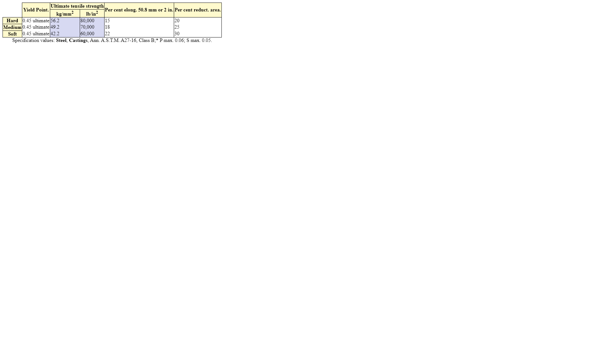

#    My First Table
The HTML Table element (\<table\>) element represents tabular data — that is, information presented in a two-dimensional table comprised of rows and columns of cells containing data

[For more details](https://developer.mozilla.org/en-US/docs/Web/HTML/Element/table)

## Requirements 
- The caption should be beneath the table
- Column and rows headers should have a thin and solid border
- Use a color picker to determine the color of the cells
- Regular cells should pnly have borders to thier sides
- Upper right cell should not be visible
- Column headers should be splitted and merged as in example
- Group the two middle columns togther and set their color
- Bonus: Dont use classes or ids

## Exepted state

