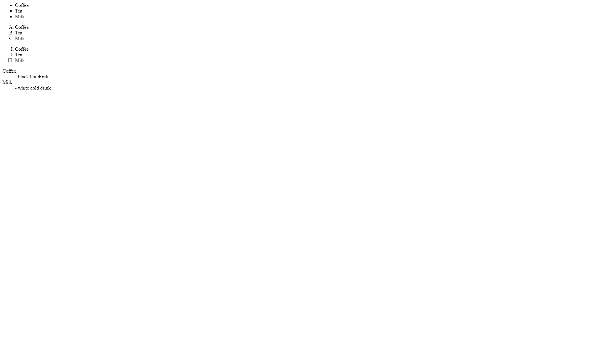

#    My First Div
The HTML Content Division element
(\<div\>) is the generic container for flow content. It has no effect on the content or layout until styled using CSS

[For more details](https://developer.mozilla.org/en-US/docs/Web/HTML/Element/div)

## Requirements 
- Create the lists with the styles in the expected result
- use the ul li tags for it https://www.w3schools.com/tags/tag_ul.asp

## Exepted state

